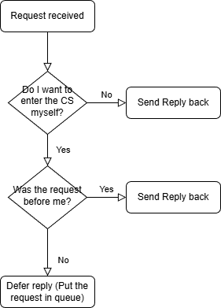

# Ricart-Argawala in Golang 
**Author(s):** Johannes Jensen  
**Course:** Distributed Systems — Handin 4  
**Date:** 12-11-2025
**Repo:** [Github repository](https://github.com/Joha6210/DistributedSystems-Handin4)

## Table of contents
- System requirements
- Discussion of Ricart-Argawala implementation
- Appendix


<div class="page"/>

## System requirements

This project aims to implement an version of the Ricart-Argawala algorithm to uphold mutual exclusion in a distributed system in golang.

The implementation should meet the requirements stated in the description: [Mandatory Activity 4](https://learnit.itu.dk/mod/assign/view.php?id=235143), R1, R2 and R3.

### R1 (Spec)

The node.go implements a "node" that acts as both a server and a client (in gRPC terms).

The main responsibility of the server is to listen for incoming request from other nodes (peers) and decide if a request should be deferred or acted upon immediately (by sending a reply back, to the requesting node). If it receives a reply from another node it notifies the client by incrementing a `replyCount` counter.

The clients responsibility is to enter the critical section (CS) when allowed to by the other peers. When the node is first started it will wait and listen for other peers before trying to enter the CS. There is a 30% chance for the node not to want to enter the CS, this is done to simulate that all processes does not want to enter the CS at all times.

The implementation of Ricart-Agrawala is loosely based upon the slides [Coordination & Agreement](https://learnit.itu.dk/pluginfile.php/394900/course/section/165227/Coordination_and_agreement.pdf?time=1761814143344) (pdf slide 15), variables names not the same etc.

The CS is simulated by a print statement that is surrounded by log and print statements:

```golang
  // Enter critical section
  log.Printf("[Node %s] ENTERING CRITICAL SECTION at clock %d", c.nodeId, s.clk)
  fmt.Printf("\n[Node %s] ENTERING CRITICAL SECTION at clock %d\n", c.nodeId, s.clk)
  s.mu.Lock()
  s.clk++
  s.mu.Unlock()
  time.Sleep(3 * time.Second)
  fmt.Printf("[Node %s] LEAVING CRITICAL SECTION at clock %d\n", c.nodeId, s.clk)
  log.Printf("[Node %s] LEAVING CRITICAL SECTION at clock %d", c.nodeId, s.clk)
```

<div class="page"/>

### R2 (Safety)

The Ricart-Agrawala algorithm makes sure that only one process (or in this instance node) enters the CS at a time.
This is done by having each node that is requesting/wanting to enter the CS, wait for all nodes(peers) in the network, to allow it, by replying to the request. Each node that the request was sent to will decide if the requesting node is allowed to enter, by checking if the node itself want to enter CS? if yes, did the requesting node come first? (checked by comparing Lamport clocks). If it answers no to the first question, then it will reply back immediately, letting the requesting node access to the CS (the requesting node will still have to wait for the rest of the peers to answer before entering), If yes to the first question and yes to the second, then it will also reply back, if otherwise it will defer the reply to when the node itself has been granted access to the CS. The following flowchart gives an overview of the process:



### R3 (Liveliness)

Every node in the system, will keep an internal queue of requests that when the nodes defer an reply it will add the request to the queue (if the request is sent after the node itself wants to enter the CS). When the node has been granted access to the CS, done the work that was necessary, it will then reply to all of the request in queue that they can access the CS.

<div class="page"/>

## Discussion of Ricart-Argawala implementation

The projects implementation of the Ricart-Argawala algorithm meets the criteria that applies to an algorithm used for mutual exclusion in a distributed system. By examining the logs of the 3 nodes, we can see that at most one node is accessing the CS at a given time, while the others are waiting for their turn. By announcing on the network when the node, currently accessing the CS, is done, it will let the other nodes use the resource at some point. Each node will let other nodes gain access first, if they requested it first, based on the Lamport Clock of the system.

- ME1 (safe): at most one process in CS at any time  
- ME2 (live): request to enter/exit eventually succeeds.
- ME3 (order): entry to CS respects happens-before of enter() calls

[Coordination & Agreement](https://learnit.itu.dk/pluginfile.php/394900/course/section/165227/Coordination_and_agreement.pdf?time=1761814143344) (pdf slide 10)

Node 3 broadcasts a CS request:

```log
2025/11/12 17:06:26 [Node 3] Broadcasting request for CS (Clock=0)
```

Node 1 and Node 2 each receive this request and send a reply:

```log
2025/11/12 17:06:26 [Node 1] Received Request from 3 (Clock=0)
2025/11/12 17:06:26 [Node 1] Sending REPLY to 3

2025/11/12 17:06:26 [Node 2] Received Request from 3 (Clock=0)
2025/11/12 17:06:26 [Node 2] Sending REPLY to 3
```

Node 3 receives the reply and enters the CS:

```log
2025/11/12 17:06:26 [Node 3] Got reply from 1 (1/2)
2025/11/12 17:06:26 [Node 3] Got reply from 2 (2/2)
2025/11/12 17:06:27 [Node 3] ENTERING CRITICAL SECTION at clock 4
```

While node 3 is in the CS it receives request from both node 1 and 2, which it defers:

```log
2025/11/12 17:06:28 [Node 3] Received Request from 1 (Clock=1)
2025/11/12 17:06:28 [Node 3] Deferred reply to 1
2025/11/12 17:06:28 [Node 3] Received Request from 2 (Clock=2)
2025/11/12 17:06:28 [Node 3] Deferred reply to 2
```
<div class="page"/>

When node 3 is done in the CS it replies to the queue (node 1 and 2):

```log
2025/11/12 17:06:30 [Node 3] LEAVING CRITICAL SECTION at clock 7
2025/11/12 17:06:30 [Node 3] Sent deferred reply to 1
2025/11/12 17:06:30 [Node 3] Sent deferred reply to 2
```

As node 1 was the first to send the request (Clock = 1), node 1 enters the CS

```log
2025/11/12 17:06:28 [Node 1] Broadcasting request for CS (Clock=1)
2025/11/12 17:06:28 [Node 1] Got reply from 2 (1/2)
2025/11/12 17:06:28 [Node 1] Received Request from 2 (Clock=2)
2025/11/12 17:06:28 [Node 1] Deferred reply to 2                    //Node 1's request has Clock = 1 which is before node 2's request
2025/11/12 17:06:30 [Node 1] Received Reply from 3 (Clock=8)
2025/11/12 17:06:30 [Node 1] Got reply from 3 (2/2)                 //Got reply from node 3 because it is done in the CS
2025/11/12 17:06:30 [Node 1] ENTERING CRITICAL SECTION at clock 9   //Go reply from 2 out of 2 nodes, and can safely enter the CS
```

After node 1 is done, it then replies to node 2:

```log
2025/11/12 17:06:33 [Node 1] LEAVING CRITICAL SECTION at clock 11
[...]
2025/11/12 17:06:33 [Node 1] Sent deferred reply to 2
```

Node 2 can now enter the CS:

```log
2025/11/12 17:06:33 [Node 2] Received Reply from 1 (Clock=12)
2025/11/12 17:06:33 [Node 2] Got reply from 1 (2/2)
2025/11/12 17:06:33 [Node 2] ENTERING CRITICAL SECTION at clock 13
```

This sequence demonstrates mutual exclusion in a distributed system using the Ricart-Agrawala algorithm in golang.

<div class="page"/>

## Appendix

### Log - Node 1

```text
2025/11/12 17:06:22 [Node 1] gRPC server now listening on :5001...
2025/11/12 17:06:22 [Node 1] Advertised on network (port 5001)
2025/11/12 17:06:25 [Node 1] Waiting for peers to appear...
2025/11/12 17:06:25 [Node 1] Discovered new peer: 2 (192.168.2.75:5002)
2025/11/12 17:06:25 [Node 1] Discovered new peer: 3 (192.168.2.75:5003)
2025/11/12 17:06:25 [Node 1] Added new peer: 2 (192.168.2.75:5002)
2025/11/12 17:06:25 [Node 1] Added new peer: 3 (192.168.2.75:5003)
2025/11/12 17:06:26 [Node 1] Decided not to enter CS this time
2025/11/12 17:06:26 [Node 1] Received Request from 3 (Clock=0)
2025/11/12 17:06:26 [Node 1] Sending REPLY to 3
2025/11/12 17:06:28 [Node 1] Broadcasting request for CS (Clock=1)
2025/11/12 17:06:28 [Node 1] Got reply from 2 (1/2)
2025/11/12 17:06:28 [Node 1] Received Request from 2 (Clock=2)
2025/11/12 17:06:28 [Node 1] Deferred reply to 2
2025/11/12 17:06:30 [Node 1] Received Reply from 3 (Clock=8)
2025/11/12 17:06:30 [Node 1] Got reply from 3 (2/2)
2025/11/12 17:06:30 [Node 1] ENTERING CRITICAL SECTION at clock 9
2025/11/12 17:06:32 [Node 1] Received Request from 3 (Clock=8)
2025/11/12 17:06:32 [Node 1] Deferred reply to 3
2025/11/12 17:06:33 [Node 1] LEAVING CRITICAL SECTION at clock 11
2025/11/12 17:06:33 [Node 1] Sent deferred reply to 3
2025/11/12 17:06:33 [Node 1] Sent deferred reply to 2
2025/11/12 17:06:35 [Node 1] Broadcasting request for CS (Clock=12)
2025/11/12 17:06:36 [Node 1] Received Reply from 2 (Clock=16)
2025/11/12 17:06:36 [Node 1] Got reply from 2 (1/2)
2025/11/12 17:06:39 [Node 1] Received Reply from 3 (Clock=19)
2025/11/12 17:06:39 [Node 1] Got reply from 3 (2/2)
2025/11/12 17:06:39 [Node 1] ENTERING CRITICAL SECTION at clock 20
2025/11/12 17:06:40 [Node 1] Received Request from 2 (Clock=16)
2025/11/12 17:06:40 [Node 1] Deferred reply to 2
2025/11/12 17:06:42 [Node 1] LEAVING CRITICAL SECTION at clock 22
2025/11/12 17:06:42 [Node 1] Sent deferred reply to 2
2025/11/12 17:06:45 [Node 1] Broadcasting request for CS (Clock=23)
2025/11/12 17:06:45 [Node 1] Got reply from 3 (1/2)
2025/11/12 17:06:46 [Node 1] Received Reply from 2 (Clock=27)
2025/11/12 17:06:46 [Node 1] Got reply from 2 (2/2)
2025/11/12 17:06:46 [Node 1] ENTERING CRITICAL SECTION at clock 28
2025/11/12 17:06:49 [Node 1] LEAVING CRITICAL SECTION at clock 29
2025/11/12 17:06:50 [Node 1] Received Request from 2 (Clock=27)
2025/11/12 17:06:50 [Node 1] Sending REPLY to 2
2025/11/12 17:06:52 [Node 1] Broadcasting request for CS (Clock=31)
2025/11/12 17:06:52 [Node 1] Got reply from 3 (1/2)
2025/11/12 17:06:52 [Node 1] Received Request from 3 (Clock=32)
2025/11/12 17:06:52 [Node 1] Deferred reply to 3
2025/11/12 17:06:54 [Node 1] Received Reply from 2 (Clock=37)
2025/11/12 17:06:54 [Node 1] Got reply from 2 (2/2)
2025/11/12 17:06:54 [Node 1] ENTERING CRITICAL SECTION at clock 38
2025/11/12 17:06:57 [Node 1] LEAVING CRITICAL SECTION at clock 39
2025/11/12 17:06:57 [Node 1] Sent deferred reply to 3
2025/11/12 17:06:59 [Node 1] Broadcasting request for CS (Clock=40)
2025/11/12 17:06:59 [Node 1] Got reply from 2 (1/2)
2025/11/12 17:07:00 [Node 1] Received Reply from 3 (Clock=44)
2025/11/12 17:07:00 [Node 1] Got reply from 3 (2/2)
2025/11/12 17:07:01 [Node 1] ENTERING CRITICAL SECTION at clock 45
2025/11/12 17:07:02 [Node 1] Received Request from 2 (Clock=41)
2025/11/12 17:07:02 [Node 1] Deferred reply to 2
2025/11/12 17:07:03 [Node 1] Received Request from 3 (Clock=45)
2025/11/12 17:07:03 [Node 1] Deferred reply to 3
2025/11/12 17:07:04 [Node 1] LEAVING CRITICAL SECTION at clock 48
2025/11/12 17:07:04 [Node 1] Sent deferred reply to 2
2025/11/12 17:07:04 [Node 1] Sent deferred reply to 3
2025/11/12 17:07:05 [Node 1] Broadcasting request for CS (Clock=49)
2025/11/12 17:07:07 [Node 1] Received Reply from 2 (Clock=53)
2025/11/12 17:07:07 [Node 1] Got reply from 2 (1/2)
2025/11/12 17:07:09 [Node 1] Received Request from 2 (Clock=53)
2025/11/12 17:07:09 [Node 1] Deferred reply to 2
2025/11/12 17:07:10 [Node 1] Received Reply from 3 (Clock=57)
2025/11/12 17:07:10 [Node 1] Got reply from 3 (2/2)
2025/11/12 17:07:10 [Node 1] ENTERING CRITICAL SECTION at clock 58
2025/11/12 17:07:13 [Node 1] LEAVING CRITICAL SECTION at clock 59
2025/11/12 17:07:13 [Node 1] Sent deferred reply to 2
2025/11/12 17:07:16 [Node 1] Received Request from 3 (Clock=57)
2025/11/12 17:07:16 [Node 1] Sending REPLY to 3
2025/11/12 17:07:16 [Node 1] Broadcasting request for CS (Clock=61)
2025/11/12 17:07:17 [Node 1] Received Reply from 2 (Clock=65)
2025/11/12 17:07:17 [Node 1] Got reply from 2 (1/2)
2025/11/12 17:07:20 [Node 1] Received Reply from 3 (Clock=68)
2025/11/12 17:07:20 [Node 1] Got reply from 3 (2/2)
2025/11/12 17:07:20 [Node 1] ENTERING CRITICAL SECTION at clock 69
2025/11/12 17:07:21 [Node 1] Received Request from 2 (Clock=65)
2025/11/12 17:07:21 [Node 1] Deferred reply to 2
2025/11/12 17:07:23 [Node 1] LEAVING CRITICAL SECTION at clock 71
2025/11/12 17:07:23 [Node 1] Sent deferred reply to 2
2025/11/12 17:07:25 [Node 1] Received Request from 3 (Clock=69)
2025/11/12 17:07:25 [Node 1] Sending REPLY to 3
2025/11/12 17:07:28 [Node 1] Broadcasting request for CS (Clock=73)
2025/11/12 17:07:28 [Node 1] Got reply from 2 (1/2)
2025/11/12 17:07:30 [Node 1] Received Reply from 3 (Clock=80)
2025/11/12 17:07:30 [Node 1] Got reply from 3 (2/2)
2025/11/12 17:07:30 [Node 1] ENTERING CRITICAL SECTION at clock 81
2025/11/12 17:07:31 [Node 1] Received Request from 2 (Clock=77)
2025/11/12 17:07:31 [Node 1] Deferred reply to 2
2025/11/12 17:07:33 [Node 1] LEAVING CRITICAL SECTION at clock 83
2025/11/12 17:07:33 [Node 1] Sent deferred reply to 2
2025/11/12 17:07:36 [Node 1] Broadcasting request for CS (Clock=84)
2025/11/12 17:07:36 [Node 1] Got reply from 3 (1/2)
2025/11/12 17:07:36 [Node 1] Received Reply from 2 (Clock=88)
2025/11/12 17:07:36 [Node 1] Got reply from 2 (2/2)
2025/11/12 17:07:36 [Node 1] ENTERING CRITICAL SECTION at clock 89
2025/11/12 17:07:39 [Node 1] Received Request from 2 (Clock=88)
2025/11/12 17:07:39 [Node 1] Deferred reply to 2
2025/11/12 17:07:39 [Node 1] LEAVING CRITICAL SECTION at clock 91
2025/11/12 17:07:39 [Node 1] Sent deferred reply to 2
2025/11/12 17:07:42 [Node 1] Broadcasting request for CS (Clock=92)
2025/11/12 17:07:42 [Node 1] Got reply from 3 (1/2)
2025/11/12 17:07:42 [Node 1] Received Request from 3 (Clock=93)
2025/11/12 17:07:42 [Node 1] Deferred reply to 3
2025/11/12 17:07:42 [Node 1] Received Reply from 2 (Clock=97)
2025/11/12 17:07:42 [Node 1] Got reply from 2 (2/2)
2025/11/12 17:07:43 [Node 1] ENTERING CRITICAL SECTION at clock 98
2025/11/12 17:07:46 [Node 1] LEAVING CRITICAL SECTION at clock 99
2025/11/12 17:07:46 [Node 1] Sent deferred reply to 3
2025/11/12 17:07:46 [Node 1] Received Request from 2 (Clock=97)
2025/11/12 17:07:46 [Node 1] Sending REPLY to 2
2025/11/12 17:07:49 [Node 1] Broadcasting request for CS (Clock=101)
2025/11/12 17:07:49 [Node 1] Received Reply from 3 (Clock=105)
2025/11/12 17:07:49 [Node 1] Got reply from 3 (1/2)
2025/11/12 17:07:52 [Node 1] Received Reply from 2 (Clock=108)
2025/11/12 17:07:52 [Node 1] Got reply from 2 (2/2)
2025/11/12 17:07:52 [Node 1] ENTERING CRITICAL SECTION at clock 109
2025/11/12 17:07:53 [Node 1] Received Request from 3 (Clock=105)
2025/11/12 17:07:53 [Node 1] Deferred reply to 3
2025/11/12 17:07:55 [Node 1] LEAVING CRITICAL SECTION at clock 111
2025/11/12 17:07:55 [Node 1] Sent deferred reply to 3
2025/11/12 17:07:57 [Node 1] Received Request from 2 (Clock=109)
2025/11/12 17:07:57 [Node 1] Sending REPLY to 2
2025/11/12 17:08:00 [Node 1] Broadcasting request for CS (Clock=113)
2025/11/12 17:08:00 [Node 1] Got reply from 3 (1/2)
```

### Log - Node 2

```text
2025/11/12 17:06:22 [Node 2] gRPC server now listening on :5002...
2025/11/12 17:06:22 [Node 2] Advertised on network (port 5002)
2025/11/12 17:06:25 [Node 2] Waiting for peers to appear...
2025/11/12 17:06:25 [Node 2] Discovered new peer: 1 (192.168.2.75:5001)
2025/11/12 17:06:25 [Node 2] Discovered new peer: 3 (192.168.2.75:5003)
2025/11/12 17:06:25 [Node 2] Added new peer: 1 (192.168.2.75:5001)
2025/11/12 17:06:25 [Node 2] Added new peer: 3 (192.168.2.75:5003)
2025/11/12 17:06:26 [Node 2] Decided not to enter CS this time
2025/11/12 17:06:26 [Node 2] Received Request from 3 (Clock=0)
2025/11/12 17:06:26 [Node 2] Sending REPLY to 3
2025/11/12 17:06:28 [Node 2] Received Request from 1 (Clock=1)
2025/11/12 17:06:28 [Node 2] Sending REPLY to 1
2025/11/12 17:06:28 [Node 2] Broadcasting request for CS (Clock=2)
2025/11/12 17:06:30 [Node 2] Received Reply from 3 (Clock=8)
2025/11/12 17:06:30 [Node 2] Got reply from 3 (1/2)
2025/11/12 17:06:32 [Node 2] Received Request from 3 (Clock=8)
2025/11/12 17:06:32 [Node 2] Deferred reply to 3
2025/11/12 17:06:33 [Node 2] Received Reply from 1 (Clock=12)
2025/11/12 17:06:33 [Node 2] Got reply from 1 (2/2)
2025/11/12 17:06:33 [Node 2] ENTERING CRITICAL SECTION at clock 13
2025/11/12 17:06:35 [Node 2] Received Request from 1 (Clock=12)
2025/11/12 17:06:35 [Node 2] Deferred reply to 1
2025/11/12 17:06:36 [Node 2] LEAVING CRITICAL SECTION at clock 15
2025/11/12 17:06:36 [Node 2] Sent deferred reply to 3
2025/11/12 17:06:36 [Node 2] Sent deferred reply to 1
2025/11/12 17:06:40 [Node 2] Broadcasting request for CS (Clock=16)
2025/11/12 17:06:40 [Node 2] Got reply from 3 (1/2)
2025/11/12 17:06:42 [Node 2] Received Reply from 1 (Clock=23)
2025/11/12 17:06:42 [Node 2] Got reply from 1 (2/2)
2025/11/12 17:06:43 [Node 2] ENTERING CRITICAL SECTION at clock 24
2025/11/12 17:06:45 [Node 2] Received Request from 1 (Clock=23)
2025/11/12 17:06:45 [Node 2] Deferred reply to 1
2025/11/12 17:06:46 [Node 2] LEAVING CRITICAL SECTION at clock 26
2025/11/12 17:06:46 [Node 2] Sent deferred reply to 1
2025/11/12 17:06:50 [Node 2] Broadcasting request for CS (Clock=27)
2025/11/12 17:06:50 [Node 2] Got reply from 1 (1/2)
2025/11/12 17:06:50 [Node 2] Got reply from 3 (2/2)
2025/11/12 17:06:51 [Node 2] ENTERING CRITICAL SECTION at clock 33
2025/11/12 17:06:52 [Node 2] Received Request from 1 (Clock=31)
2025/11/12 17:06:52 [Node 2] Deferred reply to 1
2025/11/12 17:06:52 [Node 2] Received Request from 3 (Clock=32)
2025/11/12 17:06:52 [Node 2] Deferred reply to 3
2025/11/12 17:06:54 [Node 2] LEAVING CRITICAL SECTION at clock 36
2025/11/12 17:06:54 [Node 2] Sent deferred reply to 3
2025/11/12 17:06:54 [Node 2] Sent deferred reply to 1
2025/11/12 17:06:59 [Node 2] Decided not to enter CS this time
2025/11/12 17:06:59 [Node 2] Received Request from 1 (Clock=40)
2025/11/12 17:06:59 [Node 2] Sending REPLY to 1
2025/11/12 17:07:02 [Node 2] Broadcasting request for CS (Clock=41)
2025/11/12 17:07:02 [Node 2] Got reply from 3 (1/2)
2025/11/12 17:07:03 [Node 2] Received Request from 3 (Clock=45)
2025/11/12 17:07:03 [Node 2] Deferred reply to 3
2025/11/12 17:07:04 [Node 2] Received Reply from 1 (Clock=49)
2025/11/12 17:07:04 [Node 2] Got reply from 1 (2/2)
2025/11/12 17:07:04 [Node 2] ENTERING CRITICAL SECTION at clock 50
2025/11/12 17:07:05 [Node 2] Received Request from 1 (Clock=49)
2025/11/12 17:07:05 [Node 2] Deferred reply to 1
2025/11/12 17:07:07 [Node 2] LEAVING CRITICAL SECTION at clock 52
2025/11/12 17:07:07 [Node 2] Sent deferred reply to 3
2025/11/12 17:07:07 [Node 2] Sent deferred reply to 1
2025/11/12 17:07:09 [Node 2] Broadcasting request for CS (Clock=53)
2025/11/12 17:07:10 [Node 2] Received Reply from 3 (Clock=57)
2025/11/12 17:07:10 [Node 2] Got reply from 3 (1/2)
2025/11/12 17:07:13 [Node 2] Received Reply from 1 (Clock=60)
2025/11/12 17:07:13 [Node 2] Got reply from 1 (2/2)
2025/11/12 17:07:14 [Node 2] ENTERING CRITICAL SECTION at clock 61
2025/11/12 17:07:16 [Node 2] Received Request from 3 (Clock=57)
2025/11/12 17:07:16 [Node 2] Deferred reply to 3
2025/11/12 17:07:16 [Node 2] Received Request from 1 (Clock=61)
2025/11/12 17:07:16 [Node 2] Deferred reply to 1
2025/11/12 17:07:17 [Node 2] LEAVING CRITICAL SECTION at clock 64
2025/11/12 17:07:17 [Node 2] Sent deferred reply to 1
2025/11/12 17:07:17 [Node 2] Sent deferred reply to 3
2025/11/12 17:07:21 [Node 2] Broadcasting request for CS (Clock=65)
2025/11/12 17:07:21 [Node 2] Got reply from 3 (1/2)
2025/11/12 17:07:23 [Node 2] Received Reply from 1 (Clock=72)
2025/11/12 17:07:23 [Node 2] Got reply from 1 (2/2)
2025/11/12 17:07:23 [Node 2] ENTERING CRITICAL SECTION at clock 73
2025/11/12 17:07:25 [Node 2] Received Request from 3 (Clock=69)
2025/11/12 17:07:25 [Node 2] Deferred reply to 3
2025/11/12 17:07:26 [Node 2] LEAVING CRITICAL SECTION at clock 75
2025/11/12 17:07:26 [Node 2] Sent deferred reply to 3
2025/11/12 17:07:28 [Node 2] Received Request from 1 (Clock=73)
2025/11/12 17:07:28 [Node 2] Sending REPLY to 1
2025/11/12 17:07:31 [Node 2] Broadcasting request for CS (Clock=77)
2025/11/12 17:07:31 [Node 2] Got reply from 3 (1/2)
2025/11/12 17:07:33 [Node 2] Received Reply from 1 (Clock=84)
2025/11/12 17:07:33 [Node 2] Got reply from 1 (2/2)
2025/11/12 17:07:33 [Node 2] ENTERING CRITICAL SECTION at clock 85
2025/11/12 17:07:36 [Node 2] Received Request from 1 (Clock=84)
2025/11/12 17:07:36 [Node 2] Deferred reply to 1
2025/11/12 17:07:36 [Node 2] LEAVING CRITICAL SECTION at clock 87
2025/11/12 17:07:36 [Node 2] Sent deferred reply to 1
2025/11/12 17:07:39 [Node 2] Broadcasting request for CS (Clock=88)
2025/11/12 17:07:39 [Node 2] Got reply from 3 (1/2)
2025/11/12 17:07:39 [Node 2] Received Reply from 1 (Clock=92)
2025/11/12 17:07:39 [Node 2] Got reply from 1 (2/2)
2025/11/12 17:07:39 [Node 2] ENTERING CRITICAL SECTION at clock 93
2025/11/12 17:07:42 [Node 2] Received Request from 1 (Clock=92)
2025/11/12 17:07:42 [Node 2] Deferred reply to 1
2025/11/12 17:07:42 [Node 2] Received Request from 3 (Clock=93)
2025/11/12 17:07:42 [Node 2] Deferred reply to 3
2025/11/12 17:07:42 [Node 2] LEAVING CRITICAL SECTION at clock 96
2025/11/12 17:07:42 [Node 2] Sent deferred reply to 3
2025/11/12 17:07:42 [Node 2] Sent deferred reply to 1
2025/11/12 17:07:46 [Node 2] Broadcasting request for CS (Clock=97)
2025/11/12 17:07:46 [Node 2] Got reply from 1 (1/2)
2025/11/12 17:07:49 [Node 2] Received Request from 1 (Clock=101)
2025/11/12 17:07:49 [Node 2] Deferred reply to 1
2025/11/12 17:07:49 [Node 2] Received Reply from 3 (Clock=105)
2025/11/12 17:07:49 [Node 2] Got reply from 3 (2/2)
2025/11/12 17:07:49 [Node 2] ENTERING CRITICAL SECTION at clock 106
2025/11/12 17:07:52 [Node 2] LEAVING CRITICAL SECTION at clock 107
2025/11/12 17:07:52 [Node 2] Sent deferred reply to 1
2025/11/12 17:07:53 [Node 2] Received Request from 3 (Clock=105)
2025/11/12 17:07:53 [Node 2] Sending REPLY to 3
2025/11/12 17:07:57 [Node 2] Broadcasting request for CS (Clock=109)
2025/11/12 17:07:57 [Node 2] Got reply from 1 (1/2)
2025/11/12 17:07:59 [Node 2] Received Reply from 3 (Clock=116)
2025/11/12 17:07:59 [Node 2] Got reply from 3 (2/2)
2025/11/12 17:07:59 [Node 2] ENTERING CRITICAL SECTION at clock 117
2025/11/12 17:08:00 [Node 2] Received Request from 1 (Clock=113)
2025/11/12 17:08:00 [Node 2] Deferred reply to 1
```

### Log - Node 3

```text
2025/11/12 17:06:22 [Node 3] gRPC server now listening on :5003...
2025/11/12 17:06:22 [Node 3] Advertised on network (port 5003)
2025/11/12 17:06:25 [Node 3] Waiting for peers to appear...
2025/11/12 17:06:25 [Node 3] Discovered new peer: 1 (192.168.2.75:5001)
2025/11/12 17:06:25 [Node 3] Discovered new peer: 2 (192.168.2.75:5002)
2025/11/12 17:06:25 [Node 3] Added new peer: 1 (192.168.2.75:5001)
2025/11/12 17:06:25 [Node 3] Added new peer: 2 (192.168.2.75:5002)
2025/11/12 17:06:26 [Node 3] Broadcasting request for CS (Clock=0)
2025/11/12 17:06:26 [Node 3] Got reply from 1 (1/2)
2025/11/12 17:06:26 [Node 3] Got reply from 2 (2/2)
2025/11/12 17:06:27 [Node 3] ENTERING CRITICAL SECTION at clock 4
2025/11/12 17:06:28 [Node 3] Received Request from 1 (Clock=1)
2025/11/12 17:06:28 [Node 3] Deferred reply to 1
2025/11/12 17:06:28 [Node 3] Received Request from 2 (Clock=2)
2025/11/12 17:06:28 [Node 3] Deferred reply to 2
2025/11/12 17:06:30 [Node 3] LEAVING CRITICAL SECTION at clock 7
2025/11/12 17:06:30 [Node 3] Sent deferred reply to 1
2025/11/12 17:06:30 [Node 3] Sent deferred reply to 2
2025/11/12 17:06:32 [Node 3] Broadcasting request for CS (Clock=8)
2025/11/12 17:06:33 [Node 3] Received Reply from 1 (Clock=12)
2025/11/12 17:06:33 [Node 3] Got reply from 1 (1/2)
2025/11/12 17:06:35 [Node 3] Received Request from 1 (Clock=12)
2025/11/12 17:06:35 [Node 3] Deferred reply to 1
2025/11/12 17:06:36 [Node 3] Received Reply from 2 (Clock=16)
2025/11/12 17:06:36 [Node 3] Got reply from 2 (2/2)
2025/11/12 17:06:36 [Node 3] ENTERING CRITICAL SECTION at clock 17
2025/11/12 17:06:39 [Node 3] LEAVING CRITICAL SECTION at clock 18
2025/11/12 17:06:39 [Node 3] Sent deferred reply to 1
2025/11/12 17:06:40 [Node 3] Received Request from 2 (Clock=16)
2025/11/12 17:06:40 [Node 3] Sending REPLY to 2
2025/11/12 17:06:44 [Node 3] Decided not to enter CS this time
2025/11/12 17:06:45 [Node 3] Received Request from 1 (Clock=23)
2025/11/12 17:06:45 [Node 3] Sending REPLY to 1
2025/11/12 17:06:46 [Node 3] Decided not to enter CS this time
2025/11/12 17:06:49 [Node 3] Decided not to enter CS this time
2025/11/12 17:06:50 [Node 3] Received Request from 2 (Clock=27)
2025/11/12 17:06:50 [Node 3] Sending REPLY to 2
2025/11/12 17:06:52 [Node 3] Received Request from 1 (Clock=31)
2025/11/12 17:06:52 [Node 3] Sending REPLY to 1
2025/11/12 17:06:52 [Node 3] Broadcasting request for CS (Clock=32)
2025/11/12 17:06:54 [Node 3] Received Reply from 2 (Clock=37)
2025/11/12 17:06:54 [Node 3] Got reply from 2 (1/2)
2025/11/12 17:06:57 [Node 3] Received Reply from 1 (Clock=40)
2025/11/12 17:06:57 [Node 3] Got reply from 1 (2/2)
2025/11/12 17:06:57 [Node 3] ENTERING CRITICAL SECTION at clock 41
2025/11/12 17:06:59 [Node 3] Received Request from 1 (Clock=40)
2025/11/12 17:06:59 [Node 3] Deferred reply to 1
2025/11/12 17:07:00 [Node 3] LEAVING CRITICAL SECTION at clock 43
2025/11/12 17:07:00 [Node 3] Sent deferred reply to 1
2025/11/12 17:07:02 [Node 3] Received Request from 2 (Clock=41)
2025/11/12 17:07:02 [Node 3] Sending REPLY to 2
2025/11/12 17:07:03 [Node 3] Broadcasting request for CS (Clock=45)
2025/11/12 17:07:04 [Node 3] Received Reply from 1 (Clock=49)
2025/11/12 17:07:04 [Node 3] Got reply from 1 (1/2)
2025/11/12 17:07:05 [Node 3] Received Request from 1 (Clock=49)
2025/11/12 17:07:05 [Node 3] Deferred reply to 1
2025/11/12 17:07:07 [Node 3] Received Reply from 2 (Clock=53)
2025/11/12 17:07:07 [Node 3] Got reply from 2 (2/2)
2025/11/12 17:07:07 [Node 3] ENTERING CRITICAL SECTION at clock 54
2025/11/12 17:07:09 [Node 3] Received Request from 2 (Clock=53)
2025/11/12 17:07:09 [Node 3] Deferred reply to 2
2025/11/12 17:07:10 [Node 3] LEAVING CRITICAL SECTION at clock 56
2025/11/12 17:07:10 [Node 3] Sent deferred reply to 2
2025/11/12 17:07:10 [Node 3] Sent deferred reply to 1
2025/11/12 17:07:12 [Node 3] Decided not to enter CS this time
2025/11/12 17:07:16 [Node 3] Broadcasting request for CS (Clock=57)
2025/11/12 17:07:16 [Node 3] Got reply from 1 (1/2)
2025/11/12 17:07:16 [Node 3] Received Request from 1 (Clock=61)
2025/11/12 17:07:16 [Node 3] Deferred reply to 1
2025/11/12 17:07:17 [Node 3] Received Reply from 2 (Clock=65)
2025/11/12 17:07:17 [Node 3] Got reply from 2 (2/2)
2025/11/12 17:07:17 [Node 3] ENTERING CRITICAL SECTION at clock 66
2025/11/12 17:07:20 [Node 3] LEAVING CRITICAL SECTION at clock 67
2025/11/12 17:07:20 [Node 3] Sent deferred reply to 1
2025/11/12 17:07:21 [Node 3] Received Request from 2 (Clock=65)
2025/11/12 17:07:21 [Node 3] Sending REPLY to 2
2025/11/12 17:07:25 [Node 3] Broadcasting request for CS (Clock=69)
2025/11/12 17:07:25 [Node 3] Got reply from 1 (1/2)
2025/11/12 17:07:26 [Node 3] Received Reply from 2 (Clock=76)
2025/11/12 17:07:26 [Node 3] Got reply from 2 (2/2)
2025/11/12 17:07:27 [Node 3] ENTERING CRITICAL SECTION at clock 77
2025/11/12 17:07:28 [Node 3] Received Request from 1 (Clock=73)
2025/11/12 17:07:28 [Node 3] Deferred reply to 1
2025/11/12 17:07:30 [Node 3] LEAVING CRITICAL SECTION at clock 79
2025/11/12 17:07:30 [Node 3] Sent deferred reply to 1
2025/11/12 17:07:31 [Node 3] Received Request from 2 (Clock=77)
2025/11/12 17:07:31 [Node 3] Sending REPLY to 2
2025/11/12 17:07:33 [Node 3] Decided not to enter CS this time
2025/11/12 17:07:36 [Node 3] Received Request from 1 (Clock=84)
2025/11/12 17:07:36 [Node 3] Sending REPLY to 1
2025/11/12 17:07:37 [Node 3] Decided not to enter CS this time
2025/11/12 17:07:38 [Node 3] Decided not to enter CS this time
2025/11/12 17:07:39 [Node 3] Received Request from 2 (Clock=88)
2025/11/12 17:07:39 [Node 3] Sending REPLY to 2
2025/11/12 17:07:40 [Node 3] Decided not to enter CS this time
2025/11/12 17:07:42 [Node 3] Received Request from 1 (Clock=92)
2025/11/12 17:07:42 [Node 3] Sending REPLY to 1
2025/11/12 17:07:42 [Node 3] Broadcasting request for CS (Clock=93)
2025/11/12 17:07:42 [Node 3] Received Reply from 2 (Clock=97)
2025/11/12 17:07:42 [Node 3] Got reply from 2 (1/2)
2025/11/12 17:07:46 [Node 3] Received Reply from 1 (Clock=100)
2025/11/12 17:07:46 [Node 3] Got reply from 1 (2/2)
2025/11/12 17:07:46 [Node 3] ENTERING CRITICAL SECTION at clock 101
2025/11/12 17:07:46 [Node 3] Received Request from 2 (Clock=97)
2025/11/12 17:07:46 [Node 3] Deferred reply to 2
2025/11/12 17:07:49 [Node 3] Received Request from 1 (Clock=101)
2025/11/12 17:07:49 [Node 3] Deferred reply to 1
2025/11/12 17:07:49 [Node 3] LEAVING CRITICAL SECTION at clock 104
2025/11/12 17:07:49 [Node 3] Sent deferred reply to 1
2025/11/12 17:07:49 [Node 3] Sent deferred reply to 2
2025/11/12 17:07:53 [Node 3] Broadcasting request for CS (Clock=105)
2025/11/12 17:07:53 [Node 3] Got reply from 2 (1/2)
2025/11/12 17:07:55 [Node 3] Received Reply from 1 (Clock=112)
2025/11/12 17:07:55 [Node 3] Got reply from 1 (2/2)
2025/11/12 17:07:56 [Node 3] ENTERING CRITICAL SECTION at clock 113
2025/11/12 17:07:57 [Node 3] Received Request from 2 (Clock=109)
2025/11/12 17:07:57 [Node 3] Deferred reply to 2
2025/11/12 17:07:59 [Node 3] LEAVING CRITICAL SECTION at clock 115
2025/11/12 17:07:59 [Node 3] Sent deferred reply to 2
2025/11/12 17:08:00 [Node 3] Received Request from 1 (Clock=113)
2025/11/12 17:08:00 [Node 3] Sending REPLY to 1
2025/11/12 17:08:01 [Node 3] Broadcasting request for CS (Clock=117)
```